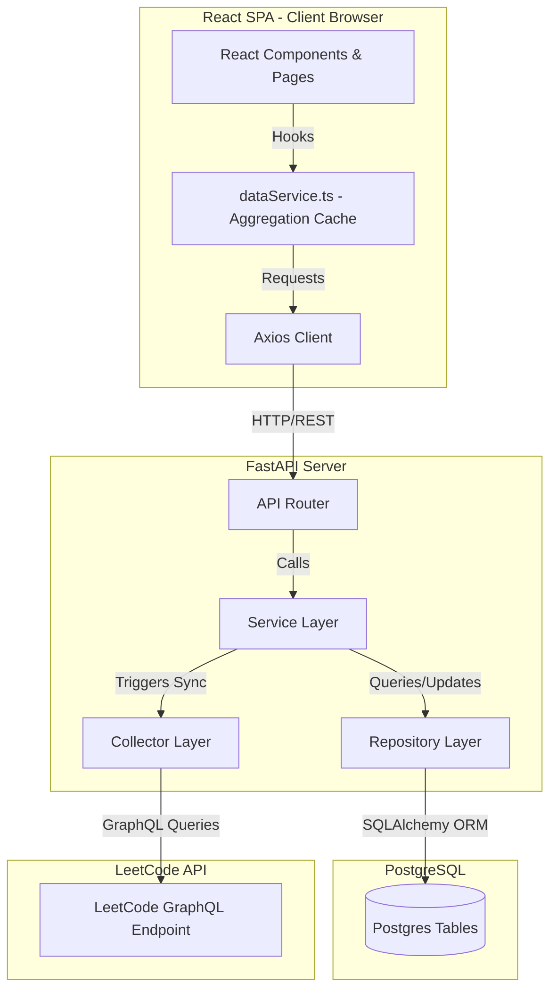
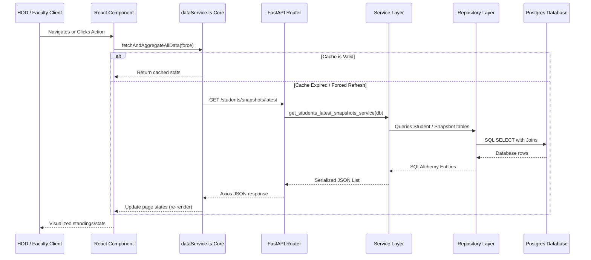
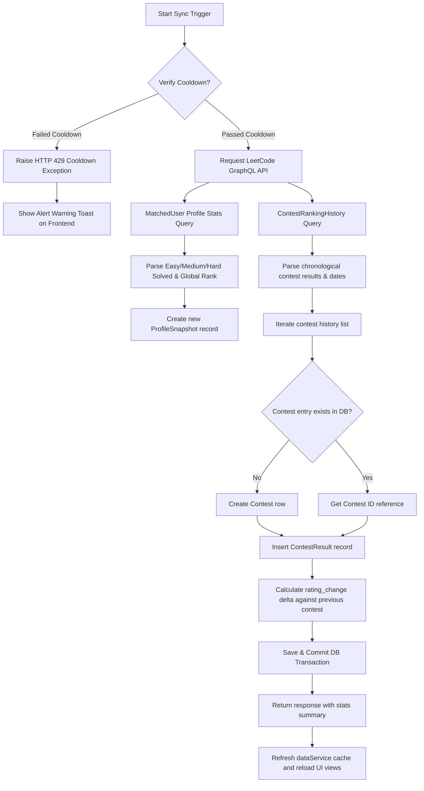
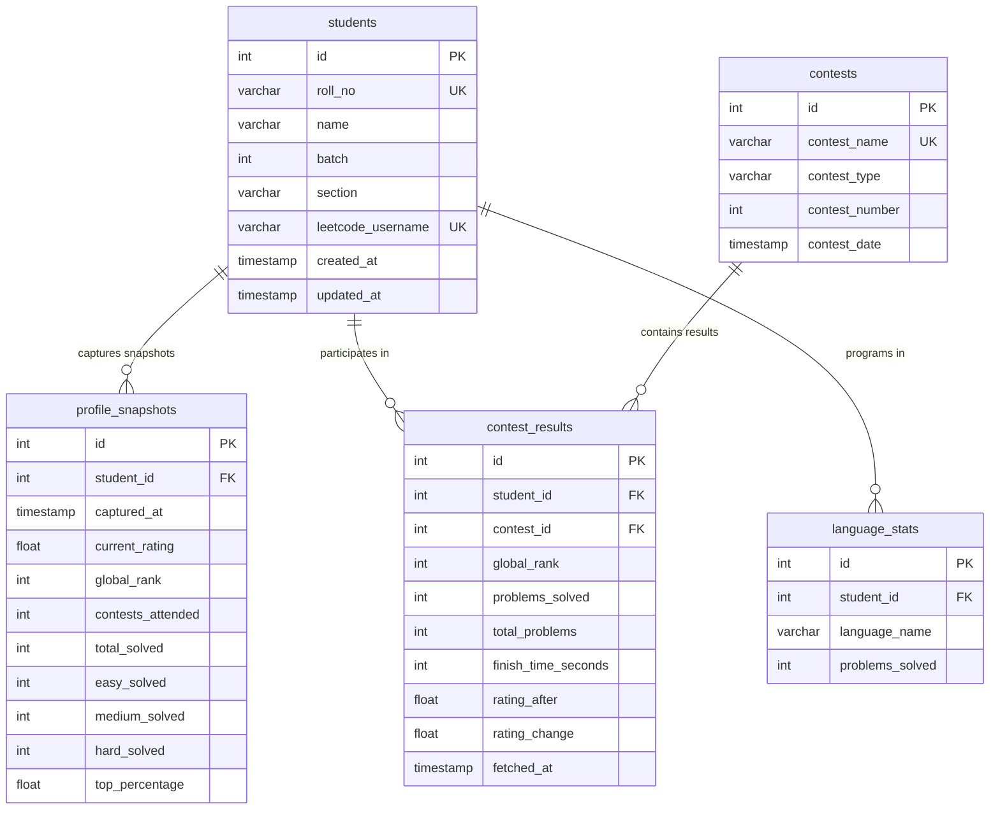

# LeetCode Department Performance Analytics Tracker — Codebase Analysis & System Reference Guide

This document provides a comprehensive codebase analysis, architectural overview, request lifecycle mapping, database schema study, and onboarding guide for the LeetCode Department Performance Analytics Tracker.

---

## 1. Overall System Architecture

The LeetCode Department Performance Analytics Tracker is structured as a modern, decoupled web application:
- **Frontend**: A single-page application (SPA) built using **React 19**, **TypeScript**, and **Tailwind CSS**. It is bundled with **Vite v8** and uses **Recharts** for visualizations and **Lucide React** for iconography.
- **Backend**: A RESTful API service built with **FastAPI** (Python 3.13), utilizing **SQLAlchemy ORM** to interface with the database.
- **Database**: **PostgreSQL** relational database.
- **Data Ingestion**: An automated collector module that executes queries against the **LeetCode GraphQL API** using Python's `requests` library.

### System Architecture Diagram



---

## 2. Request Lifecycle

The application follows a standard layered client-server request lifecycle:

1. **User Action**: The administrator clicks a sync button, or a client navigates to the rankings standings route.
2. **Frontend Aggregator Call**: The frontend checks its local aggregation cache in `dataService.ts`. If cache is invalid or a refresh is forced, it calls the Axios instance in `api.ts`.
3. **HTTP REST Call**: Axios performs an asynchronous HTTP request (e.g. `GET /students/snapshots/latest` or `POST /sync-all`) to `http://127.0.0.1:8000`.
4. **API Route Handler**: FastAPI intercepts the request, runs dependency injection for the database session (`Depends(get_db)`), performs any cooldown safety validations (returning an HTTP 429 if a cooldown is active), and delegates logic to the service layer.
5. **Service execution**: The service layer coordinates transactions, interacting with repositories to load/save DB models or calling the collectors to fetch data from LeetCode.
6. **ORM Mapping & Querying**: The repository layer executes querying templates on database tables mapped by SQLAlchemy.
7. **Response serialization**: The service output is serialized to JSON by FastAPI and returned.
8. **Client caching**: The data is aggregated in memory inside `dataService.ts`, updating the component states and updating the UI view.

### Request Flow Diagram



---

## 3. Sync Lifecycle & Data Ingestion Flow

Sync operations ingest fresh information from LeetCode's public endpoint. To safeguard the application from rate limits and API bans, the backend implements local cooldown windows.

### Cooldown Protection Rules
- **Individual Student Sync**: Limited to one execution every **60 seconds** per student.
- **Department Sync (Sync All)**: Limited to one execution every **60 seconds** globally.
- **Handling Cooldowns**: If a request violates these boundaries, the backend immediately raises an `HTTPException` with status code **429** and a detailed timeout message. The frontend intercepts this response code and displays a warning banner instead of a system crash stack.

### Ingestion Details
When a sync completes successfully:
1. The **Profile Snapshot** collector pulls total problems solved count (categorized into Easy, Medium, and Hard) and global rank.
2. The **Contest Collector** pulls contest history listings.
3. The database updates records inside the `contests`, `contest_results`, and `profile_snapshots` tables in a single transaction.

### Sync Ingestion Flow Diagram



---

## 4. Database Schema Analysis

The database uses PostgreSQL. Relationships are configured with foreign key mappings and cascade constraints to guarantee referential integrity.

### Database ER Diagram



### Table Definitions & Column Roles

#### 1. `students` Table
Acts as the department directory registry.
- `id` (INTEGER, Primary Key): Autoincrement student identifier.
- `roll_no` (VARCHAR(20), Unique Index, Nullable=False): Academic identifier.
- `name` (VARCHAR(100), Nullable=False): Student full name.
- `batch` (INTEGER, Nullable=False): Graduation cohort year.
- `section` (VARCHAR(10), Nullable=True): Section class name.
- `leetcode_username` (VARCHAR(100), Unique Index, Nullable=False): LeetCode profile handle.
- `created_at` (TIMESTAMP): Automatic timestamp when record is added.
- `updated_at` (TIMESTAMP): Automatic timestamp on row update.

#### 2. `profile_snapshots` Table
Records historical profile metrics fetched from LeetCode profiles.
- `id` (INTEGER, Primary Key): Snapshot record ID.
- `student_id` (INTEGER, Foreign Key referencing `students.id`): Student link.
- `captured_at` (TIMESTAMP, Unique Constraint with student_id): Ingestion timestamp.
- `current_rating` (FLOAT): Latest rating recorded from LeetCode.
- `global_rank` (INTEGER): LeetCode global ranking position.
- `contests_attended` (INTEGER): Number of contests attended.
- `total_solved` (INTEGER): Total count of questions solved.
- `easy_solved` / `medium_solved` / `hard_solved` (INTEGER): Subcategories of solved questions.
- `top_percentage` (FLOAT): Rating percentage tier.

#### 3. `contests` Table
Stores contest details.
- `id` (INTEGER, Primary Key): Unique contest reference.
- `contest_name` (VARCHAR(100), Unique): Full name (e.g. "Weekly Contest 350").
- `contest_type` (VARCHAR(20)): "weekly" or "biweekly" categorization.
- `contest_number` (INTEGER): LeetCode contest index identifier.
- `contest_date` (TIMESTAMP): Launch date.

#### 4. `contest_results` Table
Records a student's participation results in a contest.
- `id` (INTEGER, Primary Key): Result identifier.
- `student_id` (INTEGER, Foreign Key referencing `students.id`): Link to student.
- `contest_id` (INTEGER, Foreign Key referencing `contests.id`): Link to contest.
- `global_rank` (INTEGER): Global ranking in the contest.
- `problems_solved` (INTEGER): Problems solved in this specific contest.
- `total_problems` (INTEGER): Total problems presented (defaults to 4).
- `finish_time_seconds` (INTEGER): Duration of completion.
- `rating_after` (FLOAT): Student rating calculated after the contest.
- `rating_change` (FLOAT): Rating gain or loss.
- `fetched_at` (TIMESTAMP): Creation date.

---

## 5. API Endpoint Documentation

The FastAPI service exposes REST endpoints on `http://127.0.0.1:8000`.

### Endpoints Details

| Method | Endpoint | Description | Request Body / Params | Response Format | Cooldown Protection |
| :--- | :--- | :--- | :--- | :--- | :--- |
| **POST** | `/students` | Registers a student card and creates directory records. | `StudentCreate` (JSON) | `{"message": "...", "student_id": int}` | None |
| **GET** | `/students` | Fetches all registered students with basic parameters. | None | `[{"id": int, "name": "...", "roll_no": "...", ...}]` | None |
| **POST** | `/students/sync/{username}` | Syncs profile stats and contest history for a username. | Path param: `username` | `{"message": "...", "snapshot_id": int, ...}` | 60 seconds per student (429 if violation) |
| **POST** | `/sync-all` | Loops and syncs contest and snapshot records for all students. | None | `{"total_students": int, "successful": int, "failed": [...]}` | 60 seconds globally (429 if violation) |
| **GET** | `/students/snapshots/latest` | Returns the latest snapshot details for each student. | None | `[{"student_id": int, "total_solved": int, ...}]` | None |
| **DELETE** | `/students/{student_id}` | Destructive action deleting student, results, and snapshots. | Path param: `student_id` | `{"message": "Student deleted successfully"}` | None |
| **GET** | `/contests` | Returns all contests sorted descending by contest number. | None | `[{"id": int, "contest_name": "...", ...}]` | None |
| **GET** | `/contests/{contest_id}/results` | Returns standings of all students for a contest ID. | Path param: `contest_id` | `[{"rank": int, "student_name": "...", "rating_after": float, ...}]` | None |

---

## 6. Frontend Routing & State Management

### Client Router Mappings (`frontend/src/App.tsx`)
1. **Analytics Dashboard (`/`)**: Main landing overview.
2. **Contest Drill-down (`/contests`)**: Detailed contest analytics.
3. **Leaderboard Standings (`/rankings`)**: Leaderboard table with search, filters, and actions.
4. **Student Profile (`/students/:username`)**: Individual student progress charts and logs.
5. **Sync Center (`/sync`)**: Administrative panels for directory edits and sync executions.

### Frontend Aggregator Client (`frontend/src/services/dataService.ts`)
The client-side core acts as an in-memory database to isolate UI presentation layers from aggregation computations:
- **Cache Lifecycle**: Caches fetched student, contest, and result arrays. The cache is valid for **1 minute** (`CACHE_TTL_MS = 60000`). If a route loads within this window, it reads from the cache to prevent redundant API calls. If `fetchAndAggregateAllData(true)` is called, it reloads all raw records and rebuilds statistics.
- **Aggregation Computations**:
  - `StudentWithStats` mappings: Computes average contest rank, chronological rating histories, rating changes, and merges `total_solved` counts retrieved from the latest profile snapshots.
  - `DepartmentStats` calculations: Computes cohort active stand percentages, groups students into ratings bins (e.g. `< 1400`, `1400-1599`, `1600-1799`, `≥ 1800`), processes growth timeline rating averages, and returns filtered leadership lists (Top Rated, Most Improved, High Performers).

---

## 7. File-by-File Analysis

### Backend Files

#### 1. `main.py`
- **Purpose**: Server starter configuration.
- **Responsibility**: Bootstraps the FastAPI application, mounts API routers, and configures CORS middleware.
- **Imported Dependencies**: `fastapi.FastAPI`, `fastapi.middleware.cors.CORSMiddleware`, student router, contest router.
- **Exported Functions/Classes**: `app` (FastAPI instance).
- **Internal Flow**: Instantiates FastAPI, appends CORS middleware configuration (ports 5173/5174 allowed), mounts routers, and runs.
- **How it connects to other files**: Includes `student_routes.py` and `contest_routes.py` routers.
- **Critical business logic**: CORS origin security.
- **Potential risks**: Configuration must be updated if the frontend deployment port changes.
- **Future improvement opportunities**: Integrate production logging and environment configurations.

#### 2. `app/database/connection.py`
- **Purpose**: Database engine manager.
- **Responsibility**: Creates the SQLAlchemy engine linked to the PostgreSQL database.
- **Imported Dependencies**: `sqlalchemy.create_engine`.
- **Exported Functions/Classes**: `engine`, `DATABASE_URL` (string).
- **Internal Flow**: Constructs the SQLAlchemy database engine using `postgresql://` string.
- **How it connects to other files**: Mapped by `session.py` to create connection sessions.
- **Critical business logic**: Connection pool creation.
- **Potential risks**: Hardcoded database credentials in connection strings.
- **Future improvement opportunities**: Read connections from secure environment variables.

#### 3. `app/database/session.py`
- **Purpose**: Database session generator.
- **Responsibility**: Provides the database session factory `SessionLocal`.
- **Imported Dependencies**: `sqlalchemy.orm.sessionmaker`, `connection.engine`.
- **Exported Functions/Classes**: `SessionLocal`.
- **Internal Flow**: Initializes `sessionmaker` bound to connection engine.
- **How it connects to other files**: Imported by routers to generate db sessions via dependency injection.
- **Critical business logic**: DB session transaction lifecycle management.
- **Potential risks**: Connection leaks if sessions are not properly closed in try-finally statements.
- **Future improvement opportunities**: Transition to asynchronous session makers.

#### 4. `app/database/base.py`
- **Purpose**: SQLAlchemy declarative base provider.
- **Responsibility**: Shares the SQLAlchemy declarative model class mapping metadata.
- **Imported Dependencies**: `sqlalchemy.orm.declarative_base`.
- **Exported Functions/Classes**: `Base`.
- **Internal Flow**: Creates a single declarative metadata instance.
- **How it connects to other files**: Imported by database models to define tables.
- **Critical business logic**: ORM base mapping.
- **Potential risks**: Modifying it changes global model declarations.
- **Future improvement opportunities**: Add utility audit columns.

#### 5. `app/models/student.py`
- **Purpose**: Student database model.
- **Responsibility**: Maps the `students` table, declaring directory credentials and relationships.
- **Imported Dependencies**: `sqlalchemy.Column`, `sqlalchemy.Integer`, `sqlalchemy.String`, `sqlalchemy.DateTime`, `sqlalchemy.sql.func`, `sqlalchemy.orm.relationship`, `base.Base`.
- **Exported Functions/Classes**: `Student` class.
- **Internal Flow**: Declares fields (id, roll_no, name, batch, section, leetcode_username, timestamp) and setups cascade relationships.
- **How it connects to other files**: Linked with `ProfileSnapshot`, `ContestResult`, and `LanguageStat`.
- **Critical business logic**: Unique constraint enforcements on roll numbers and usernames.
- **Potential risks**: Cascade deletion removes all student performance history if triggered.
- **Future improvement opportunities**: Add indices on section and batch columns.

#### 6. `app/models/profile_snapshot.py`
- **Purpose**: Profile snapshot model.
- **Responsibility**: Maps the `profile_snapshots` database table.
- **Imported Dependencies**: `sqlalchemy.Column`, `sqlalchemy.Integer`, `sqlalchemy.Float`, `sqlalchemy.DateTime`, `sqlalchemy.ForeignKey`, `sqlalchemy.UniqueConstraint`, `sqlalchemy.sql.func`, `sqlalchemy.orm.relationship`, `base.Base`.
- **Exported Functions/Classes**: `ProfileSnapshot` class.
- **Internal Flow**: Defines snapshot credentials and joins with `Student` model.
- **How it connects to other files**: Referenced by `Student` and repository queries.
- **Critical business logic**: Unique index on `(student_id, captured_at)` to prevent redundant snapshots.
- **Potential risks**: Snapshot growth may bloat db size over time.
- **Future improvement opportunities**: Implement a retention policy for historical snapshots.

#### 7. `app/models/contest.py`
- **Purpose**: Contest entity database model.
- **Responsibility**: Maps the `contests` table.
- **Imported Dependencies**: `sqlalchemy.Column`, `sqlalchemy.Integer`, `sqlalchemy.String`, `sqlalchemy.DateTime`, `sqlalchemy.UniqueConstraint`, `sqlalchemy.orm.relationship`, `base.Base`.
- **Exported Functions/Classes**: `Contest` class.
- **Internal Flow**: Defines details for contests (name, number, date, type).
- **How it connects to other files**: Linked with `ContestResult`.
- **Critical business logic**: Unique check on `contest_name`.
- **Potential risks**: Duplicate name inserts cause validation failure.
- **Future improvement opportunities**: Add support for team contests.

#### 8. `app/models/contest_result.py`
- **Purpose**: Student-to-Contest result association model.
- **Responsibility**: Maps the `contest_results` table.
- **Imported Dependencies**: `sqlalchemy.Column`, `sqlalchemy.Integer`, `sqlalchemy.Float`, `sqlalchemy.DateTime`, `sqlalchemy.ForeignKey`, `sqlalchemy.UniqueConstraint`, `sqlalchemy.sql.func`, `sqlalchemy.orm.relationship`, `base.Base`.
- **Exported Functions/Classes**: `ContestResult` class.
- **Internal Flow**: Connects a student to a contest, storing rating, ranks, and solved counts.
- **How it connects to other files**: References `Student` and `Contest`.
- **Critical business logic**: Unique constraint on `(student_id, contest_id)`.
- **Potential risks**: Incorrect rating changes if rows are inserted out of chronological order.
- **Future improvement opportunities**: Add an index on `rating_after`.

#### 9. `app/models/language_stat.py`
- **Purpose**: Student language statistics database model.
- **Responsibility**: Maps the `language_stats` table.
- **Imported Dependencies**: `sqlalchemy.Column`, `sqlalchemy.Integer`, `sqlalchemy.String`, `sqlalchemy.ForeignKey`, `sqlalchemy.UniqueConstraint`, `sqlalchemy.orm.relationship`, `base.Base`.
- **Exported Functions/Classes**: `LanguageStat` class.
- **Internal Flow**: Maps languages and problem counts to student IDs.
- **How it connects to other files**: Joins with `Student` model.
- **Critical business logic**: Unique constraint on `(student_id, language_name)`.
- **Potential risks**: Unused schema currently (not active in collectors).
- **Future improvement opportunities**: Populate languages via profile sync processes.

#### 10. `app/schemas/student_schema.py`
- **Purpose**: Pydantic validation schemas.
- **Responsibility**: Defines validation schema requirements for student registrations.
- **Imported Dependencies**: `pydantic.BaseModel`.
- **Exported Functions/Classes**: `StudentCreate`.
- **Internal Flow**: Exposes registration fields.
- **How it connects to other files**: Used by `student_routes.py` to validate student create payloads.
- **Critical business logic**: Enforces field types and presence.
- **Potential risks**: Schema mismatches if model validation needs update.
- **Future improvement opportunities**: Add regex validations for roll numbers.

#### 11. `app/api/student_routes.py`
- **Purpose**: Student route handlers.
- **Responsibility**: Handles student management, sync executions, and latest snapshot retrievals.
- **Imported Dependencies**: `fastapi.APIRouter`, `fastapi.Depends`, `fastapi.HTTPException`, `sqlalchemy.orm.Session`, `datetime.datetime`, `delete_student_service`, `create_student_service`, `get_all_students_service`, `sync_all_students_service`, `get_students_latest_snapshots_service`, session database helpers.
- **Exported Functions/Classes**: `router`, `get_db`.
- **Internal Flow**: Runs API routes, checks cooldown, calls services, commits transactions.
- **How it connects to other files**: Routes map to service layers and write to database models.
- **Critical business logic**: 60-second individual and department sync cooldown constraints.
- **Potential risks**: In-memory dict `student_sync_times` resets on server restarts.
- **Future improvement opportunities**: Use Redis for distributed cooldown states.

#### 12. `app/api/contest_routes.py`
- **Purpose**: Contest route handlers.
- **Responsibility**: Exposes endpoints for loading contests and their respective results.
- **Imported Dependencies**: `fastapi.APIRouter`, `fastapi.Depends`, `sqlalchemy.orm.Session`, `get_all_contests_service`, `get_contest_results_service`.
- **Exported Functions/Classes**: `router`.
- **Internal Flow**: Standard GET routing calling query services.
- **How it connects to other files**: Calls `contest_query_service.py` to fetch database records.
- **Critical business logic**: Exposes contest drill-down statistics.
- **Potential risks**: Large result payloads if student directories scale to thousands.
- **Future improvement opportunities**: Implement pagination.

#### 13. `app/graphql/contest_queries.py`
- **Purpose**: LeetCode GraphQL contest queries string.
- **Responsibility**: GraphQL request query body.
- **Imported Dependencies**: None.
- **Exported Functions/Classes**: `CONTEST_QUERY` string.
- **Internal Flow**: Hardcoded query text.
- **How it connects to other files**: Read by contest collectors.
- **Critical business logic**: Requests attended, rankings, and histories.
- **Potential risks**: LeetCode API schema changes could break the query structure.
- **Future improvement opportunities**: None.

#### 14. `app/graphql/profile_queries.py`
- **Purpose**: LeetCode GraphQL profile query string.
- **Responsibility**: Holds the user details query template.
- **Imported Dependencies**: None.
- **Exported Functions/Classes**: `PROFILE_QUERY`.
- **Internal Flow**: GraphQL syntax query text.
- **How it connects to other files**: Imported by profile collectors.
- **Critical business logic**: Collects rankings and AC submission counts.
- **Potential risks**: Dependent on LeetCode's matchedUser schema.
- **Future improvement opportunities**: None.

#### 15. `app/graphql/language_queries.py`
- **Purpose**: LeetCode GraphQL language query string.
- **Responsibility**: Holds query template for language stats.
- **Imported Dependencies**: None.
- **Exported Functions/Classes**: `LANGUAGE_QUERY`.
- **Internal Flow**: GraphQL syntax query text.
- **How it connects to other files**: Imported by language collectors.
- **Critical business logic**: Collects problem counts per programming language.
- **Potential risks**: Unused placeholder.
- **Future improvement opportunities**: Activate inside sync pipelines.

#### 16. `app/collectors/graphql_client.py`
- **Purpose**: LeetCode GraphQL client client wrapper.
- **Responsibility**: Standard POST handler queries executor.
- **Imported Dependencies**: `requests`.
- **Exported Functions/Classes**: `execute_query`.
- **Internal Flow**: Posts query strings and variables to `leetcode.com/graphql`.
- **How it connects to other files**: Executed by all collector handlers.
- **Critical business logic**: 30-second timeout constraints and HTTP error checks.
- **Potential risks**: LeetCode rate limits, user agent blocking, or timeouts.
- **Future improvement opportunities**: Add proxy rotation or retries with exponential backoff.

#### 17. `app/collectors/profile_collector.py`
- **Purpose**: Matches users profile scraper.
- **Responsibility**: Parses solved counts.
- **Imported Dependencies**: `execute_query`, `PROFILE_QUERY`.
- **Exported Functions/Classes**: `collect_profile`.
- **Internal Flow**: Requests profile metrics for a student username, parses JSON response.
- **How it connects to other files**: Used by `profile_snapshot_builder.py`.
- **Critical business logic**: Extracts total, easy, medium, and hard solved counts.
- **Potential risks**: Null returns if user profile is private or matching fails.
- **Future improvement opportunities**: Gracefully handle missing matchedUser records.

#### 18. `app/collectors/contest_collector.py`
- **Purpose**: Contest rankings stats scraper.
- **Responsibility**: Fetches current rating, attended contest counts, global ranks.
- **Imported Dependencies**: `execute_query`, `CONTEST_QUERY`.
- **Exported Functions/Classes**: `collect_contest_data`.
- **Internal Flow**: Queries user's current contest standing.
- **How it connects to other files**: Executed by profile snapshot builders.
- **Critical business logic**: Maps rating, attended, and rank numbers.
- **Potential risks**: Null response if student has never attended a contest.
- **Future improvement opportunities**: Inject default values for unrated students.

#### 19. `app/collectors/contest_history_collector.py`
- **Purpose**: Contest rankings history scraper.
- **Responsibility**: Fetches the user's contest history records.
- **Imported Dependencies**: `execute_query`, `CONTEST_QUERY`.
- **Exported Functions/Classes**: `collect_contest_history`.
- **Internal Flow**: Returns lists of attended contests, ranks, and ratings.
- **How it connects to other files**: Used by contest sync services.
- **Critical business logic**: Raw query output delivery.
- **Potential risks**: Fails if history is hidden or private on LeetCode.
- **Future improvement opportunities**: Graceful error wrappers.

#### 20. `app/collectors/language_collector.py`
- **Purpose**: Empty placeholder query collector.
- **Responsibility**: None.
- **Imported Dependencies**: None.
- **Exported Functions/Classes**: None.
- **Internal Flow**: Empty.
- **How it connects to other files**: None.
- **Critical business logic**: None.
- **Potential risks**: None.
- **Future improvement opportunities**: Implement language statistics parser.

#### 21. `app/services/student_service.py`
- **Purpose**: Student database services.
- **Responsibility**: Handles database creations, deletions, and snapshot queries.
- **Imported Dependencies**: `create_student`, `get_by_leetcode_username`, `get_by_roll_no`, `get_all_students`, `delete_student`, `delete_results_by_student_id`, `delete_snapshots_by_student_id`, `sync_student_snapshot`, `sync_student_contests`, database models.
- **Exported Functions/Classes**: `create_student_service`, `get_all_students_service`, `sync_all_students_service`, `get_students_latest_snapshots_service`, `delete_student_service`.
- **Internal Flow**: Validates roll number uniqueness, manages db transactions, performs profile syncs.
- **How it connects to other files**: Interacts with repositories and API routers.
- **Critical business logic**: Student record deletions execute cascade deletes of related results and snapshots.
- **Potential risks**: Sync loop delays if a single student query times out.
- **Future improvement opportunities**: Parallelize individual sync actions.

#### 22. `app/services/profile_snapshot_service.py`
- **Purpose**: Profile snapshot services.
- **Responsibility**: Handles student profile sync execution and database snapshot saves.
- **Imported Dependencies**: `get_by_leetcode_username`, `create_snapshot`, `build_profile_snapshot`.
- **Exported Functions/Classes**: `sync_student_snapshot`.
- **Internal Flow**: Gets student ID, requests profile data, creates a snapshot record.
- **How it connects to other files**: Called by routes and bulk sync tasks.
- **Critical business logic**: Automates snapshot updates.
- **Potential risks**: High frequency requests trigger LeetCode rate limits.
- **Future improvement opportunities**: Add batch snapshot generation.

#### 23. `app/services/profile_snapshot_builder.py`
- **Purpose**: Snapshot metadata builder.
- **Responsibility**: Merges query metrics from profile and contest collectors.
- **Imported Dependencies**: `collect_profile`, `collect_contest_data`.
- **Exported Functions/Classes**: `build_profile_snapshot`.
- **Internal Flow**: Fetches from profile and contest collectors and structures a unified snapshot dictionary.
- **How it connects to other files**: Called by `profile_snapshot_service.py`.
- **Critical business logic**: Combines separate GraphQL query outputs.
- **Potential risks**: A failure in one collector halts the builder.
- **Future improvement opportunities**: Add fallback logic for partial query failures.

#### 24. `app/services/contest_service.py`
- **Purpose**: Contest database service.
- **Responsibility**: Checks and saves contest results.
- **Imported Dependencies**: `datetime`, `timezone`, `get_by_leetcode_username`, `get_or_create_contest`, `create_result`, `get_result_by_student_and_contest`, `collect_contest_history`.
- **Exported Functions/Classes**: `sync_student_contests`.
- **Internal Flow**: Fetches contest history, checks for existing database records, saves results chronologically, and calculates rating changes.
- **How it connects to other files**: Interacts with contest and result repositories.
- **Critical business logic**: Chronological sort order and rating change calculations.
- **Potential risks**: Out-of-order records skew rating changes.
- **Future improvement opportunities**: Add database locks to prevent concurrent sync operations on the same user.

#### 25. `app/services/contest_query_service.py`
- **Purpose**: Contest database query services.
- **Responsibility**: Fetches contests and ranks results.
- **Imported Dependencies**: `get_all_contests`, `get_results_by_contest`.
- **Exported Functions/Classes**: `get_all_contests_service`, `get_contest_results_service`.
- **Internal Flow**: Fetches all students' results for a contest and sorts them by rank.
- **How it connects to other files**: Called by `contest_routes.py`.
- **Critical business logic**: Sorts and maps user rankings for drill-down views.
- **Potential risks**: Inefficient sorting inside Python memory instead of database queries.
- **Future improvement opportunities**: Use database-level sorting.

#### 26. `app/repositories/student_repository.py`
- **Purpose**: Student database query helper.
- **Responsibility**: Queries and inserts student records.
- **Imported Dependencies**: `Student` model.
- **Exported Functions/Classes**: `get_by_leetcode_username`, `get_by_roll_no`, `get_by_id`, `get_all_students`, `create_student`, `delete_student`, `update_student`.
- **Internal Flow**: Runs standard SQLAlchemy queries on the `students` table.
- **How it connects to other files**: Used by `student_service.py`.
- **Critical business logic**: Enforces schema lookups.
- **Potential risks**: Queries block thread executions.
- **Future improvement opportunities**: Convert to async SQLAlchemy operations.

#### 27. `app/repositories/profile_snapshot_repository.py`
- **Purpose**: Snapshot database helper.
- **Responsibility**: Creates and deletes snapshot records.
- **Imported Dependencies**: `ProfileSnapshot` model.
- **Exported Functions/Classes**: `create_snapshot`, `delete_snapshots_by_student_id`.
- **Internal Flow**: Maps snapshot dictionaries to ORM models.
- **How it connects to other files**: Used by services.
- **Critical business logic**: Transaction management.
- **Potential risks**: Large volume insertions.
- **Future improvement opportunities**: Implement bulk insertion helper methods.

#### 28. `app/repositories/contest_repository.py`
- **Purpose**: Contest database repository helper.
- **Responsibility**: Database insertions and lookups for contests.
- **Imported Dependencies**: `Contest` model.
- **Exported Functions/Classes**: `get_by_name`, `create_contest`, `get_or_create_contest`, `get_all_contests`.
- **Internal Flow**: Standard SQLAlchemy lookup and insertion logic.
- **How it connects to other files**: Used by contest sync services.
- **Critical business logic**: Gets or creates contest rows based on name.
- **Potential risks**: Race conditions during concurrent writes.
- **Future improvement opportunities**: Add index constraint check logic.

#### 29. `app/repositories/contest_result_repository.py`
- **Purpose**: Result database repository helper.
- **Responsibility**: Manages contest results.
- **Imported Dependencies**: `ContestResult` model, `Contest` model.
- **Exported Functions/Classes**: `create_result`, `get_results_by_student`, `get_results_by_contest`, `get_result_by_student_and_contest`, `get_all_contests`, `delete_results_by_student_id`.
- **Internal Flow**: Standard SQLAlchemy query templates.
- **How it connects to other files**: Used by contest and query services.
- **Critical business logic**: Exposes results filtered by student or contest ID.
- **Potential risks**: Queries can load huge data structures into memory.
- **Future improvement opportunities**: Implement pagination at the database level.

---

### Frontend Files

#### 30. `frontend/src/main.tsx`
- **Purpose**: Vite React entrypoint.
- **Responsibility**: Mounts the main React application tree.
- **Imported Dependencies**: `react.StrictMode`, `react-dom/client.createRoot`, `App`, CSS.
- **Exported Functions/Classes**: None.
- **Internal Flow**: Mounts `<App />` inside the `#root` element.
- **How it connects to other files**: Renders `App.tsx`.
- **Critical business logic**: Root UI mounting.
- **Potential risks**: Application load fails if root element is missing.
- **Future improvement opportunities**: Integrate error boundary screens.

#### 31. `frontend/src/App.tsx`
- **Purpose**: Frontend page router.
- **Responsibility**: Matches routes to pages.
- **Imported Dependencies**: `react-router-dom`, page components.
- **Exported Functions/Classes**: `App`.
- **Internal Flow**: Exposes route configurations.
- **How it connects to other files**: Routes user requests to corresponding pages.
- **Critical business logic**: Application routing.
- **Potential risks**: Broken redirects if path parameters are altered.
- **Future improvement opportunities**: Implement route loading indicators.

#### 32. `frontend/src/services/api.ts`
- **Purpose**: Axios HTTP client setup.
- **Responsibility**: Configures base Axios parameters.
- **Imported Dependencies**: `axios`.
- **Exported Functions/Classes**: `api` (instance).
- **Internal Flow**: Instantiates Axios with `127.0.0.1:8000` base URL.
- **How it connects to other files**: Used by `dataService.ts`.
- **Critical business logic**: Centralizes base endpoint configuration.
- **Potential risks**: Port mismatches if backend is launched elsewhere.
- **Future improvement opportunities**: Read base URL from environment configurations.

#### 33. `frontend/src/services/dataService.ts`
- **Purpose**: Frontend data aggregator and cache.
- **Responsibility**: Manages in-memory caching and aggregates statistics.
- **Imported Dependencies**: `api` client.
- **Exported Functions/Classes**: interfaces, caching functions, data aggregation functions.
- **Internal Flow**: Fetches raw data from backend APIs and processes them into statistics models.
- **How it connects to other files**: Shared data core for all page views.
- **Critical business logic**: Isolates calculations to simplify future backend integration.
- **Potential risks**: Heavy computations can lag low-end client devices.
- **Future improvement opportunities**: Move calculations to Web Workers.

#### 34. `frontend/src/components/Sidebar.tsx`
- **Purpose**: Main navigation component.
- **Responsibility**: Renders sidebar links.
- **Imported Dependencies**: `react-router-dom.NavLink`, `lucide-react` icons.
- **Exported Functions/Classes**: `Sidebar`.
- **Internal Flow**: Displays navigation links with active visual states.
- **How it connects to other files**: Rendered by `DashboardLayout.tsx`.
- **Critical business logic**: Navigational flows.
- **Potential risks**: Broken routing if layout sizes shift.
- **Future improvement opportunities**: Expose collapsible views.

#### 35. `frontend/src/layouts/DashboardLayout.tsx`
- **Purpose**: Master page frame layout.
- **Responsibility**: Implements sidebar navigation, visual backdrops, and grids.
- **Imported Dependencies**: `Sidebar`.
- **Exported Functions/Classes**: `DashboardLayout`.
- **Internal Flow**: Integrates Sidebar with slot overlays.
- **How it connects to other files**: Wraps all routing page views.
- **Critical business logic**: Page structure consistency.
- **Potential risks**: Layout breaks if nested elements overflow screen widths.
- **Future improvement opportunities**: Optimize background gradient performance.

#### 36. `frontend/src/pages/AnalyticsPage.tsx`
- **Purpose**: Executive dashboard page.
- **Responsibility**: Renders top metrics, leaderboards, and progress trends.
- **Imported Dependencies**: `lucide-react` icons, Recharts components, layouts, data services.
- **Exported Functions/Classes**: `AnalyticsPage`.
- **Internal Flow**: Fetches cache, maps student lists, renders grids and charts.
- **How it connects to other files**: Queries data core statistics.
- **Critical business logic**: Renders readable analytics overview.
- **Potential risks**: Performance lag during Recharts rendering.
- **Future improvement opportunities**: Implement real-time auto-refresh loops.

#### 37. `frontend/src/pages/RankingsPage.tsx`
- **Purpose**: Rankings page.
- **Responsibility**: Leaderboard table view with search, sorting, and action triggers.
- **Imported Dependencies**: icons, layouts, service calls, React states.
- **Exported Functions/Classes**: `RankingsPage`.
- **Internal Flow**: Fetches statistics, applies searches/filters, manages delete safety modals.
- **How it connects to other files**: Maps details to student cards.
- **Critical business logic**: Unified student rankings, search, and delete modals.
- **Potential risks**: Accidental student deletions if modals fail.
- **Future improvement opportunities**: Implement pagination.

#### 38. `frontend/src/pages/ContestPage.tsx`
- **Purpose**: Contest dashboard page.
- **Responsibility**: Displays contest dropdown selector and results table.
- **Imported Dependencies**: icons, layouts, service calls, components.
- **Exported Functions/Classes**: `ContestPage`.
- **Internal Flow**: Processes contests list, maps filters, and renders results.
- **How it connects to other files**: Imports `ContestResultsTable.tsx`.
- **Critical business logic**: Limits dropdown menu list to the most recent 15 contests.
- **Potential risks**: Filters can yield empty results.
- **Future improvement opportunities**: Add visual trend indicators.

#### 39. `frontend/src/pages/StudentProfilePage.tsx`
- **Purpose**: Student detail page.
- **Responsibility**: Displays individual stats, timelines, and progress charts.
- **Imported Dependencies**: icons, routes, layouts, dataService methods, Recharts.
- **Exported Functions/Classes**: `StudentProfilePage`.
- **Internal Flow**: Loads student context, processes ratings arrays, renders logs and deletes.
- **How it connects to other files**: Integrates details from dataService.
- **Critical business logic**: Exposes contest history and total solved snapshot count.
- **Potential risks**: Chart displays fail if database records are empty.
- **Future improvement opportunities**: Add comparison view with other student profiles.

#### 40. `frontend/src/pages/SyncPage.tsx`
- **Purpose**: Sync Center dashboard page.
- **Responsibility**: Renders trigger operations, registers students, displays summary cards.
- **Imported Dependencies**: icons, layouts, services, React references.
- **Exported Functions/Classes**: `SyncPage`.
- **Internal Flow**: Handles sync triggers, handles cooldown warnings, and scrolls console logs.
- **How it connects to other files**: Updates global caches upon success.
- **Critical business logic**: Cooldown warning banners and sync status statistics summaries.
- **Potential risks**: Form submissions can block UI during syncs.
- **Future improvement opportunities**: Add progress bar.

---

## 8. Analytics Computation Flow

All calculations are client-side in `frontend/src/services/dataService.ts`.

### Mapped Calculations Reference
1. **`total_solved`**: Extracted from the latest record in `profile_snapshots` (pulled from LeetCode matches).
2. **`latest_rating`**: Taken from `rating_after` of the chronologically last contest result row.
3. **`contests_attended`**: Length of the contest history list.
4. **`rating_change`**: Accumulator summing all `rating_change` values from contest records.
5. **`average_rank`**: Integer average of all contest rankings.
6. **`active_percentage`**: Percentage of students with contest attendance count > 0.
7. **`rating_distribution`**: Counts students in brackets: `< 1400`, `1400-1599`, `1600-1799`, and `≥ 1800` based on `latest_rating`.

---

## 9. Security, Performance & Scalability Review

### Security Review
- **CORS Constraints**: FastAPI allows requests only from ports `5173`/`5174`.
- **Destructive Confirmations**: Destructive deletion operations are protected by warning modals on the frontend.
- **API Inputs**: Database insertions are validated by Pydantic models.
- **SQL Injection**: Using SQLAlchemy ORM prevents raw SQL injections.

### Performance Review
- **In-Memory Caching**: Caches department standings to limit backend queries.
- **Vite 8 Build**: Light assets bundle compiled in less than 300ms.
- **Data Aggregation**: Heavy client-side calculations may impact performance on low-end devices if student numbers exceed thousands.

### Scalability Review
- **Ingestion Scale**: Ingesting contest data for hundreds of students in a single-threaded loop can cause timeouts.
- **Database Scale**: Relational indexing on roll numbers and contest IDs keeps querying fast.
- **Web Scaling**: The backend service must be decoupled from in-memory state variables (like `student_sync_times`) to support multi-instance cluster configurations.

---

## 10. Project Knowledge Base (Onboarding Guide)

### Project Overview
The LeetCode Department Performance Analytics Tracker monitors and ranks students based on LeetCode contest performance. The frontend aggregates raw data into visual indicators for faculty review.

### Quick Start Commands
Ensure python3, node, and Postgres are active.

#### Backend setup:
```bash
# Create and activate environment
python -m venv venv
source venv/bin/activate

# Install dependencies
pip install -r requirements.txt

# Run migrations
alembic upgrade head

# Launch Uvicorn dev server
uvicorn main:app --reload --port 8000
```

#### Frontend setup:
```bash
# Enter directory
cd frontend

# Install dependencies
npm install

# Run dev server
npm run dev
```

### Directory Map
- `app/api/`: Contains route definitions (e.g. `student_routes.py` for sync and delete operations).
- `app/collectors/`: Houses HTTP clients requesting data from LeetCode's GraphQL API.
- `app/services/`: Services handling database records insertions and sync states.
- `app/repositories/`: Mapped SQL queries.
- `frontend/src/services/dataService.ts`: Shared data engine mapping rankings and trend lines.
- `frontend/src/pages/`: Page components (Overview, Standings, Drill-down, Sync).

### Developer Guidance
1. **API Rules**: Always validate payload formats using Pydantic models.
2. **Data Consistency**: Do not run data computations inside page elements. Compute metrics in `dataService.ts` to keep views clean.
3. **Database Rules**: Never execute raw query statements. Always run updates through repository helper classes to ensure database transactions rollback on errors.
