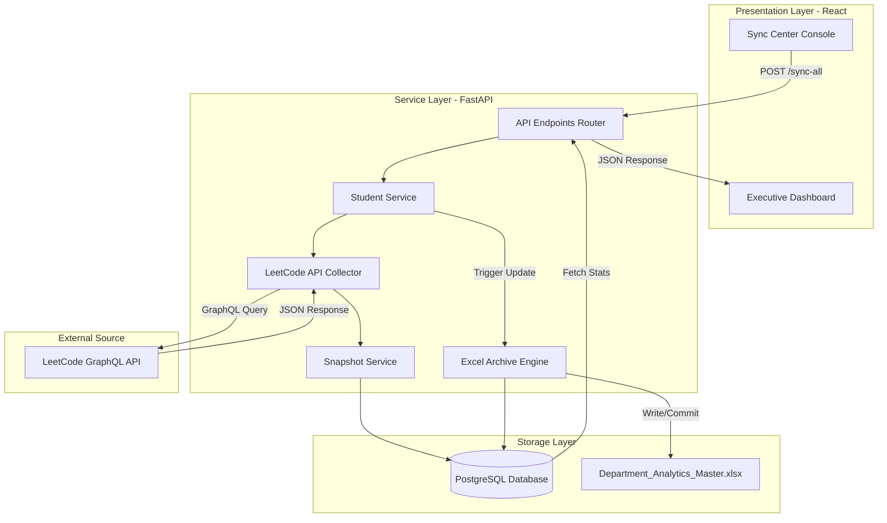
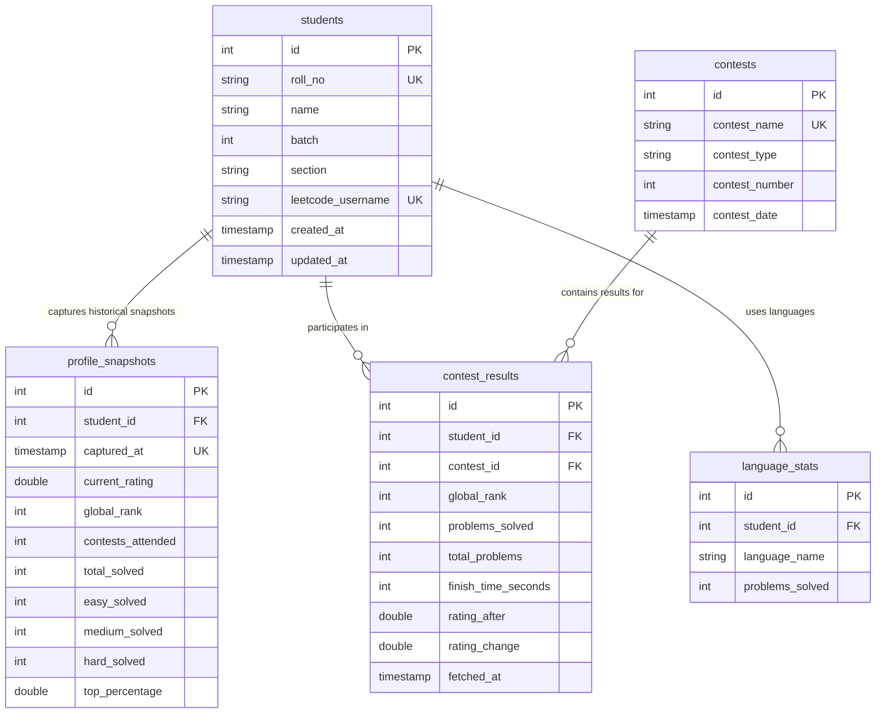

# 📊 LeetCode Department Analytics Platform (LDAP)

[](https://www.python.org/)
[](https://fastapi.tiangolo.com/)
[](https://www.postgresql.org/)
[](https://reactjs.org/)
[](https://tailwindcss.com/)
[](https://openpyxl.readthedocs.io/)

A state-of-the-art **Executive Intelligence Center** for department heads, placement coordinators, and faculty leads to monitor, audit, and direct student coding progress. This platform acts as the authoritative source of truth, automating LeetCode profile tracking and producing historical performance archives to support critical educational decisions.

---

## 🎯 Product & Business Context

Unlike generic student dashboards designed for simple visualization, LDAP is focused entirely on **Executive Decision Making**. The platform's layout, APIs, and archival engines are built to answer critical department-level questions at a glance:

> 1. **How is the department performing overall?**
> 2. **Who is improving rapidly and who is declining?**
> 3. **Which batches/sections are performing best?**
> 4. **Which students need immediate faculty intervention?**
> 5. **What performance shifts occurred this week vs. this month?**
> 6. **Where should placement coordinators focus their attention?**

---

## 🛠️ System Architecture

LDAP is structured as a decoupled two-tier application utilizing a FastAPI service layer and a React client-side presentation layer. 

### Ingestion & Data Flow Pipeline



---

## 💾 Database Schema

The database consists of 5 core tables managed via SQLAlchemy ORM mapping historical snapshots, contest participation, and language statistics.



---

## 🚀 Core Features

### 1. Time-Window Analytics (Weekly & Monthly)
Metrics are calculated comparing specific time-windows to identify real-time student activity shifts instead of cumulative, lifetime gains:
* **Weekly Performance**: Compares the current 7-day period against the previous 7 days (Contest rating differences, problems solved delta, and active contest participation shifts).
* **Monthly Performance**: Compares the current 30-day snapshot against the previous 30 days.

### 2. Department Standings Redesign
A high-density spreadsheet-style table optimized for sorting student achievements:
* Left-aligned text columns (Rank, Student, Roll No) combined with right-aligned numeric columns (Rating, Easy, Medium, Hard, and Total Solved) for optimal readability.
* Multi-field sorting supporting difficulty-specific solves and contest ratings.

### 3. Automated Excel Archival Audit
* **Authoritative Archive**: Writes directly to a single file `Department_Analytics_Master.xlsx` at the project root folder.
* **Summary Sheet**: Sheet 1 serves as an audit log detailing chronological sync runs, average ratings, and difficulty solve ratios.
* **Deduplication**: Running multiple sync operations on the same calendar day overwrites that day's sheet (e.g. `10-Jul-2026`) and updates the Summary log row instead of adding duplicates.
* **Missing Value Fallbacks**: Evaluates missing/failed user statistics to `"NA"`, preventing zero-skewed metrics or crashing.

---

## 📁 Project Directory Structure

```text
Leetcode-Tracker/
├── app/                              # FastAPI Backend Application
│   ├── api/                          # HTTP Routers (Student & Contest endpoints)
│   ├── database/                     # DB Session setup & Connection drivers
│   ├── models/                       # SQLAlchemy Database Schema models
│   ├── repositories/                 # SQL database CRUD transactions
│   ├── services/                     # Business Logic (Averages, Ranks, Time-windows)
│   │   ├── excel_service.py          # Master Workbook generation (Summary & Date sheets)
│   │   ├── student_service.py        # Student syncing coordination & cooldowns
│   │   └── analytics_service.py      # Calculations for time-window deltas
│   └── collectors/                   # LeetCode GraphQL API HTTP engines
├── docs/                             # DB specifications and spec outlines
├── frontend/                         # Vite + React Client App
│   ├── src/
│   │   ├── layouts/                  # Base dashboards container shells
│   │   ├── pages/                    # Rankings, Analytics, and Sync console
│   │   ├── services/                 # API connection mappings
│   │   └── index.css                 # Base system layout & typography
│   ├── vite.config.ts
│   └── package.json
├── Department_Analytics_Master.xlsx  # Authoritative Archival Spreadsheet
├── main.py                           # Application launcher entry point
├── requirements.txt                  # Python dependencies
└── walkthrough.md                    # Changelog and verification records
```

---

## ⚙️ Installation & Developer Guide

### Prerequisites
* Python 3.11+
* Node.js 18+
* PostgreSQL server running locally

### 1. Database Setup
Create a PostgreSQL database named `leetcode_tracker` on your local server:
```sql
CREATE DATABASE leetcode_tracker;
```

### 2. Environment Configuration
Create a `.env` file at the root of the directory:
```env
DATABASE_URL=postgresql://postgres:<password>@localhost:5432/leetcode_tracker
```

### 3. Backend Setup
1. Create a virtual environment and activate it:
   ```bash
   python -m venv venv
   source venv/bin/activate
   ```
2. Install dependencies:
   ```bash
   pip install -r requirements.txt
   pip install openpyxl
   ```
3. Run the backend dev server:
   ```bash
   uvicorn main:app --reload --port 8000
   ```

### 4. Frontend Setup
1. Navigate to the frontend directory:
   ```bash
   cd frontend
   ```
2. Install npm packages:
   ```bash
   npm install
   ```
3. Launch the Vite local dev server:
   ```bash
   npm run dev
   ```
4. Open your browser and navigate to `http://localhost:5173`.

---

## 📊 Excel Archival System Specifications

The automated archive updates immediately after a **Sync All** operation:

### Sheet 1: `Summary` (Audit Log)
| Sync Date | Total Students | Successful Students | Failed Students | Average Rating | Average Problems Solved | Average Easy | Average Medium | Average Hard |
| :--- | :--- | :--- | :--- | :--- | :--- | :--- | :--- | :--- |
| 09-Jul-2026 | 63 | 63 | 0 | 1497 | 441 | 253 | 163 | 25 |
| 10-Jul-2026 | 63 | 63 | 0 | 1496 | 447 | 256 | 166 | 25 |

### Snapshot Sheet (e.g. `10-Jul-2026`)
| Roll No | Student Name | LeetCode Username | Contest Rating | Total Solved | Easy Solved | Medium Solved | Hard Solved | Latest Weekly Contest Rank | Latest Biweekly Contest Rank |
| :--- | :--- | :--- | :--- | :--- | :--- | :--- | :--- | :--- | :--- |
| 24CB0060 | Vaishnavee | VaishnaveeMurugan | 1483.17 | 346 | 190 | 147 | 9 | 9125 | 9175 |
| 24CB0041 | Rahul Elango | rahulelango1906 | 1270.63 | 427 | 151 | 225 | 51 | 18939 | 13500 |

---

## 🛡️ Data Collection & Cooldown Policy
* **Sync Frequency**: Snapshot sync is scheduled to run every Sunday.
* **API Cooldown**: To protect against LeetCode GraphQL rate limiting, a strict **60-second cooldown** is enforced on the `/sync-all` endpoint between requests, returning a `429 Too Many Requests` if violated.
